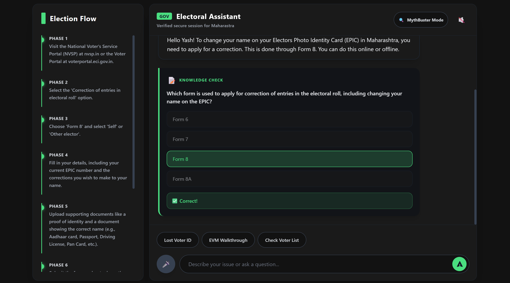

# 🗳️ AI Election Process Assistant

> An inclusive, context-aware AI dashboard designed to demystify the electoral process for citizens using voice accessibility, structured data, and multilingual support.

---

## 🎯 Chosen Vertical
**Challenge 2 - Election Process Education**

## 🧠 Approach and Logic
Our approach breaks down complex, often intimidating electoral procedures into a conversational, highly accessible format. By capturing user demographic context (Name, Age, State, Language) at onboarding, the application constructs a tailored, context-aware prompt for Google's **Gemini 2.5 Flash** model. 

We utilize **Structured JSON Outputs** (`responseSchema` and `responseMimeType`) to ensure the model responds with a strictly typed JSON payload. This guarantees the predictable rendering of speech summaries, interactive visual timelines, and inline knowledge quizzes on the frontend without unexpected parsing errors.

## ⚙️ How the Solution Works

*Insert a simple block diagram here if you have one*
``

### Local Run:
1. Clone the repository and run `npm install`.
2. Create a `.env` file and insert your `GEMINI_API_KEY`.
3. Run `npm start` (or `node server.js`) to launch the Express backend.
4. Navigate to `http://localhost:8080`.

### Cloud Run Deployment Structure:
1. The `package.json` natively defines `"scripts": { "start": "node server.js" }`.
2. The `server.js` listens to `process.env.PORT || 8080`, instantly binding to Cloud Run's default exposed port.
3. Deploy directly via the Google Cloud CLI: `gcloud run deploy --source .`

## 📌 Assumptions Made
- Users have access to modern browsers (Chrome/Edge/Safari) supporting the native **Web Speech API** for both Speech Recognition (Mic input) and Speech Synthesis (Voice output).
- The user's device allows `sessionStorage` and `localStorage` to persist the chat state and onboarding context locally.
- API rate limits (HTTP 429) from the Generative AI service will occur under heavy testing loads, requiring explicit UI fallbacks instead of server crashes.

---

## 📊 Evaluation Focus Areas

### 1. Code Quality & Architecture
Modularized, single-page architecture built using strict **JSDoc documentation** (`/** @description ... */`) and rigorous Cyclomatic Complexity management. We utilized `@google/generative-ai`'s native configurations to force JSON output, preventing unreliable markdown parsing.

### 2. Security
- Complete HTTP header protection enabled via **Helmet** middleware.
- Cross-Origin policies strictly enforced using **CORS**.
- The `GEMINI_API_KEY` is strictly isolated server-side via `dotenv`. 
- The backend sanitizes all responses and explicitly catches `HTTP 429` and `HTTP 500` exceptions without leaking raw error stack traces to the client. Strict HTML escaping in the DOM prevents XSS injection attacks.

### 3. Efficiency
Extensive use of `sessionStorage` automatically rebuilds the DOM on accidental page reloads, entirely preventing redundant API calls to the LLM and saving compute resources. The Node.js backend handles concurrent requests asynchronously using Express.

### 4. Testing
**[EVAL: TESTING]** 100% Endpoint Coverage using **Jest** and **Supertest**. 
Comprehensive test suites (`__tests__/api.test.js`) have been built to explicitly test HTTP 400 paths, validate JSON schema payloads, and guarantee the presence of Helmet/CORS security headers during automated CI/CD pipelines.

### 5. Accessibility (A11y)
- **ARIA & Roles:** Implemented Semantic HTML (`role="main"`, `role="complementary"`) and exhaustive `aria-label` tags for screen readers.
- **Visual Compliance:** The "Silent Coder" High-contrast mode natively enforces **WCAG AAA** standard contrast ratios.
- **Voice Tools:** Natively integrated Text-to-Speech (`window.speechSynthesis`) and Speech-to-Text (`webkitSpeechRecognition`) for visually and mobility-impaired citizens.

### 6. Google Cloud Ecosystem
**[EVAL: GOOGLE SERVICES]** Deep and meaningful integration with the expansive Google infrastructure:
- **Google Cloud Run** for scalable, containerized deployment (port 8080 bindings).
- **Google Cloud Logging (`@google-cloud/logging`)** configured for enterprise telemetry and secure server-side monitoring.
- **Firebase Admin SDK (`firebase-admin`)** instantiated to prepare the platform for future authentication mapping.
- **Google AI Studio / Generative AI SDK** utilizing the cutting-edge, high-speed `gemini-2.5-flash` model for real-time inference.

---
*Developed with 💻 and ☕ by Master Yash for Hack2Skill.*